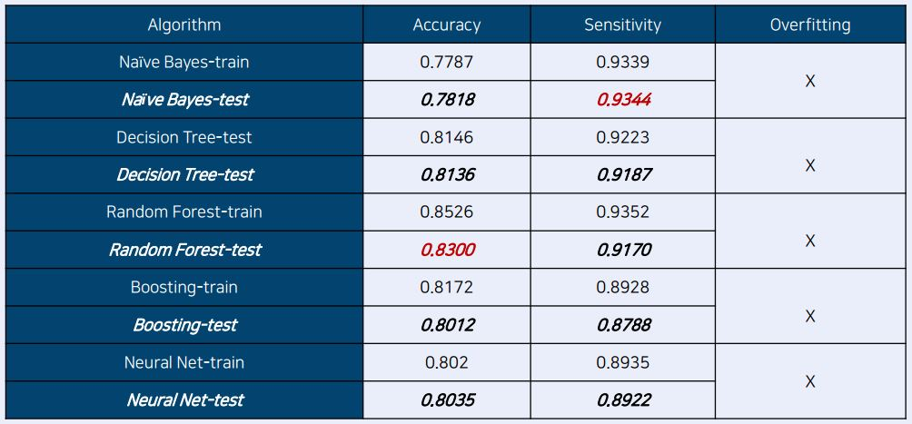
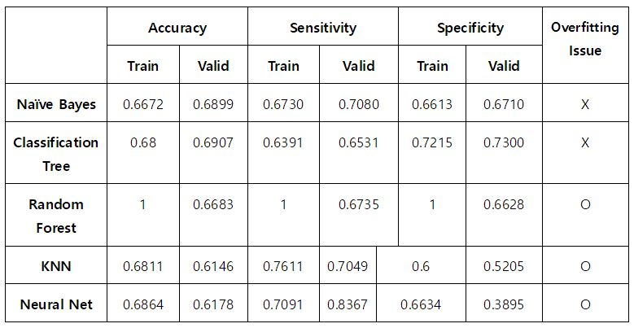

2020-1-Data-Mining-for-Business-Analytics
===================
> Several data mining methods(ex. Naive Bayes, KNN, Decision Tree, Neural Nets, Association Rules) for business analytics.

> used R and Rapidminer to exercise on my own, and also did two final projects using kaggle data.

-------------------------------------

### 1. R basics
**How to handle vector and data**
- vector operation
- handle several data types(numeric, character, factor, logical, date)
- handle several data structures(vector, data frame, matrix, array, list)
- handle missing data

### 2. Naive Bayes
**Predict whether a passenger is survived or dead from the accident by using categorical(discrete) predictors**
**use titanic data**
- change all data types into factor
- train-valid split
- run naive bayes
- ROC curve, AUC, lift chart, confusion matrix

### 3. KNN
**Classify the type of iris plant by using numerical(continuous) predictors
use iris data**
- train-valid split
- find best k and run KNN
- show confusion matrix
- report expected class of new data

### 4. Decision Tree
**Classify competitive auctions from noncompetitive auctions by using predictors
use e-commerce trading data**
- train-valid split
- run decision tree
- parameter tunning (prunning)
- show confusion matrix and get rules 

### 5. Neural Net
**Predict if the client will subscribe (yes/no) a term deposit by using predictors
use bank data**
- train-valid split
- use 2 hidden layer with 3,2 nodes each
- show confusion matrix and accuracy

### 6. Association Rules
**Build a model that will help in packaging and sequencing courses
use course data**
- generate frequent itemsets
- generate association rules and interpret the rules

-----------------------------
### Project1. Hotel Booking Cancelation Prediction
members: 김수빈, 김수정, 배수언, 차주형

**1. 호텔 예약 취소 예측 모델 구축의 필요성**
- 정확한 수요 예측 가능
- 기존의 예약 취소 패널티 제도의 부작용 존재, 따라서 예약 취소 가능성이 높은 고객을 타겟팅한 전략적 서비스 필요
- OTA 시장의 확대로 인한 예약 취소 현상 심화, 따라서 데이터 기반의 모델로 대응 필요

**2. 데이터셋 소개**
- 출처: Kaggle
- 2015/06/01 ~ 2017/08/31 포르투갈 호텔의 실제 예약 데이터

**3. 데이터 전처리**
- 호텔 산업 전체로 일반화하기 어려운 변수 제거
- 설명이 부족하여 정체를 알 수 없는 변수 제거
- 범주형 변수를 factor type으로 변환
- 결측치 처리
- 기존 변수를 활용하여, 의미있을 법한 새로운 변수 제작
- 숫자형 변수를 binning하여 범주형 변수로 변환
- random forest 모델을 실행하여 variance importance를 확인, 중요도가 높은 상위 약 20개 변수를 최종 변수로 선택

**4. 적용한 DM 알고리즘**
- Naive Bayes
- Decision Tree : Classification Tree
- Decision Tree : Random Forest
- Decision Tree : Boosted Tree
- Neural Net

**5. 적용 결과** 
 
</img>
- accuracy는 Random Forest가 0.8300으로 가장 높았고, sensitivity는 Naive Bayes가 0.9344로 가장 높았다. 
- overfitting은 모든 모델에서 나타나지 않았다. 

**6. 결론 및 제언**
- 예약금 제도가 예약 취소 여부에 영향을 미치지 않는다 -> 예약금 제도의 실효성이 부족하다는 의미이므로 새로운 패널티 방법 고안이 필요하다.
- 이전에 예약을 취소한 적이 있는 고객이 또 예약을 취소하는 경우가 많다 -> 예약 취소 내역이 있는 고객 관리가 필요하다. (명단 관리, 설문 조사)
- 예약을 수정한 적이 없는 고객이 오히려 예약을 취소하는 경우가 많다 -> 편리한 예약 변경 서비스 개발이 필요하다. (예약 취소보다는 변경 유도)

---------------------------------
### Project2. Fundraising Prediction
member: 김수정

**1. 데이터셋 소개**
- 데이터셋 이름: fundraising
- 기부할지 여부를 예측하는 classification model 필요

**2. 적용한 DM 알고리즘**
- Naive Bayes
- Classification Tree
- KNN
- Neural Net

**3. 적용 결과**
 
</img>
